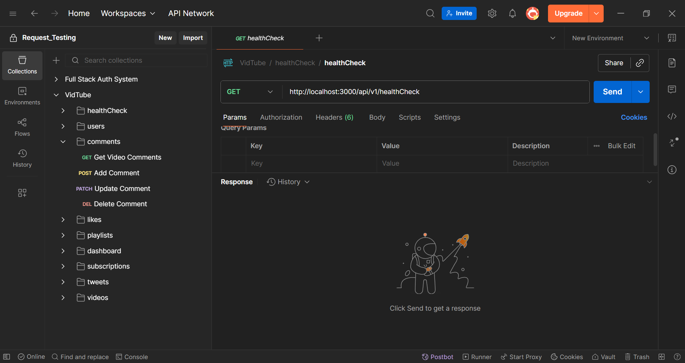
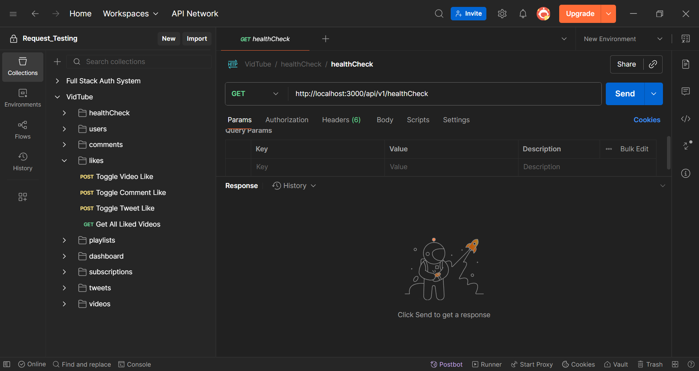
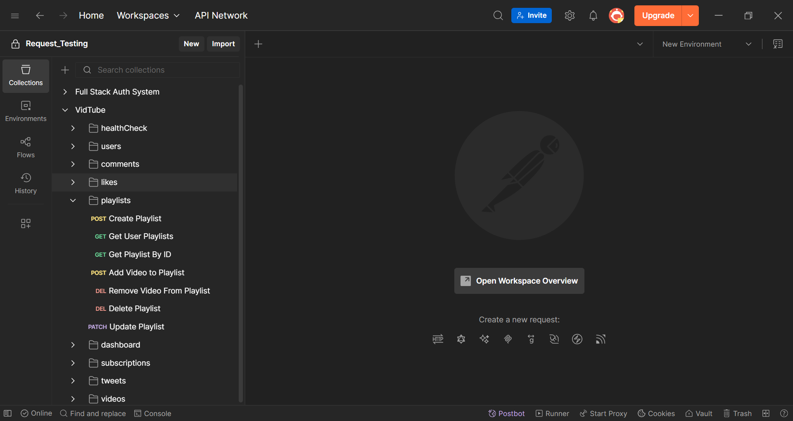
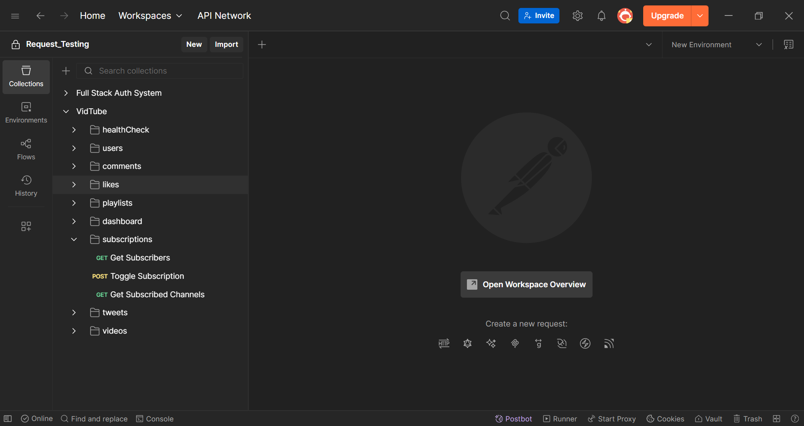
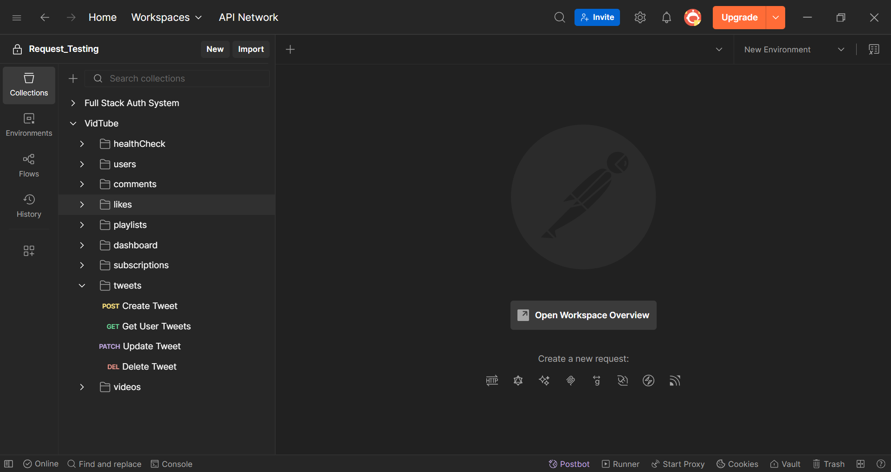
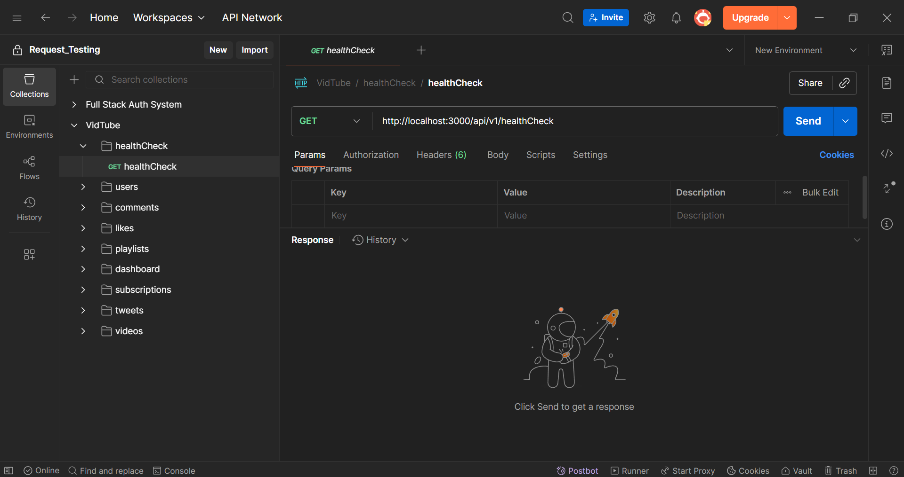
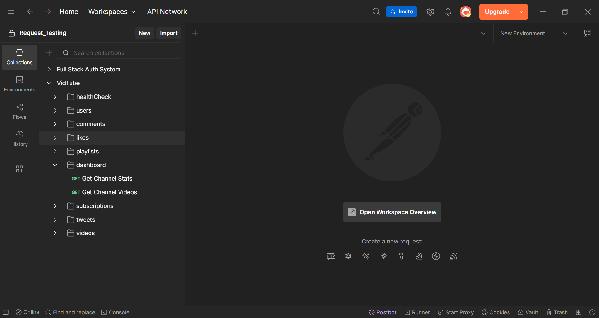
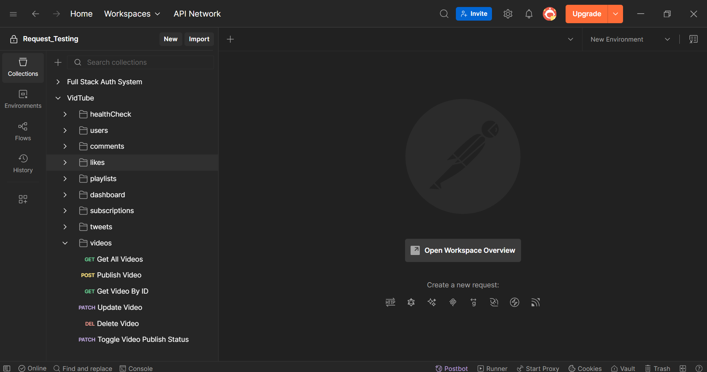

# VidTube Video Streaming Back-End App

The Web App designed is inspired by the renowned Youtube Video Streaming service.

## ✅ Features

### User Management

- Authentication using JWT Tokens.
- Register / Login User
- Upload and Stream Videos
- Update User Details (Name, Avatar, Cover Image etc)
- Get User Watch History

### Comments Management

- CRUD Operations on Video Comments.

### Likes Management

- Toggle Likes on Videos, Comments and Tweets.

### Playlist Management

- CRUD Operations on User Playlists.
- Add / Remove Videos from Playlists.

### Dashboard Access

- Get Channel Stats (Total Videos, Total Views, Subscribers List, Subscribed Channels List etc)
- Get Channel Videos

### Subscriptions Management

- Fetch Subscribers List
- Fetch Subscribed Channels List
- Toggle Subscription

### Tweets Management

- CRUD Operations on User Tweets.

### Videos Management

- CRUD Operations on User Videos.

## 🛠️ Tech Stack

- ExpressJs
- MongoDB
- NodeJs
- Cloudinary
- JWT
- Multer

## 🚀 Getting Started

As this is a Back-End only App, use of Postman is advised to access the routes.

## 📸 Screenshots of Routes in Postman











## 🔗 Routes

Here is the list of all routes

### HealthCheck Route

- GET api/v1/healthCheck (HealthCheck Route)

### User Routes

- POST api/v1/users/register (Register User)
- POST api/v1/users/login (Login User)
- POST api/v1/users/logout (Logout User)
- POST api/v1/users/refresh-token (Refresh Token)
- POST api/v1/users/change-password (Change Password)
- GET api/v1/users/current-user (Get Current User)
- PATCH api/v1/users/update-account (Update Account Details)
- PATCH api/v1/users/update-avatar (Update Avatar)
- PATCH api/v1/users/update-cover-image (Update Cover Image)
- GET api/v1/users/profile/:username (User Profile)
- GET api/v1/users/watch-history (Get Watch History)

### Comments Routes

- GET api/v1/comments/:videoId (Get Video Comments)
- POST api/v1/comments/:videoId (Add Video Comment)
- PATCH api/v1/comments/:commentId (Update Comment)
- DELETE api/v1/comments/:commentId (Delete Comment)

### Likes Routes

- POST api/v1/likes/video/:videoId (Toggle Video Like)
- POST api/v1/likes/comment/:commentId (Toggle Comment Like)
- POST api/v1/likes/tweet/:tweetId (Toggle Tweet Like)
- GET api/v1/likes/liked-videos (Get All Liked Videos)

### Playlists Routes

- POST api/v1/playlists/playlist/create-playlist (Create Playlist)
- GET api/v1/playlists/user-playlists/:userId (Get User Playlists)
- GET api/v1/playlists/playlist/:playlistId (Get Playlist By ID)
- POST api/v1/playlists/playlist/:playlistId/video/:videoId (Add Video to Playlist)
- POST api/v1/playlists/playlist/:playlistId/video/:videoId (Remove Video from Playlist)
- DELETE api/v1/playlists/playlist/:playlistId (Delete Playlist)
- DELETE api/v1/playlists/playlist/:playlistId (Update Playlist)

### Dashboard Routes

- GET api/v1/dashboard/channel-stats (Get Channel Stats)
- GET api/v1/dashboard/channel-videos (Get Channel Videos)

### Subscriptions Routes

- GET api/v1/subscriptions/subscribers/:channelId (Get Subscribers)
- POST api/v1/subscriptions/:channelId (Toggle Subscription)
- GET api/v1/subscriptions/subscribed-channels/:subscriberId (Get Subscribed Channels)

### Tweets Routes

- POST api/v1/tweets (Create Tweet)
- GET api/v1/tweets/:userId (Get User Tweets)
- PATCH api/v1/tweets/:tweetId (Update Tweet)
- DELETE api/v1/tweets/:tweetId (Delete Tweet)

### Videos Routes

- GET api/v1/videos?query={Optional} (Get All Videos)
- POST api/v1/videos/publish-video (Publish Video)
- GET api/v1/videos/:videoId (Get Video By ID)
- PATCH api/v1/videos/:videoId (Update Video)
- DELETE api/v1/videos/:videoId (Delete Video)
- PATCH api/v1/videos/toggle-publish-status/:videoId (Toggle Video Publish Status)

## Installation / Access

### 📦 On Local Machine

```bash
npm run dev
```

### 🌐 Using Vercel Link

https://password-generator-eta-cyan-16.vercel.app/
